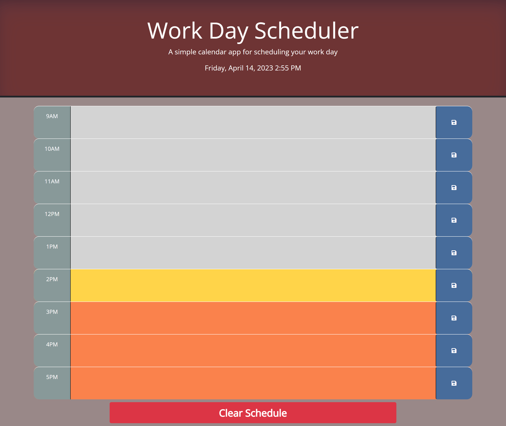

# Work Day Schedular

## Description

This is a great application to keep your work day organized for maximum efficiency! You will be able to take your standard work day (9am-5pm) and break it down to hourly tasks. Just type in a task or event for each hour of the work day, and then save it to revisit at any time. The application shows the current date and time at the top, and also color coordinates the time blocks to show whether it is a past, present, or future time block in relation to the current time. Once you are finished with your productive work day (or wish to clear the schedule for any reason), you can use the 'Clear Schedule' button at the bottom.

Get ready to be more productive and efficient, and utilize this application to help further your career!

## Motivation

Here is a list of my motivations for this project!

- Practice using Bootstrap
- Practice using jQuery for a better understanding of legacy code
- Gain a better understanding and utilization of dayjs
- Gain a better understanding and utilization of the keyword 'this'
- Create an application that would benefit me personally and potentially help others

## Deployed Webpage

[Click here to go to my fully deployed application!](https://erikbenedict.github.io/work-day-scheduler/)

## Screenshots

## Author

Erik Benedict  
erik.r.benedict@gmail.com
